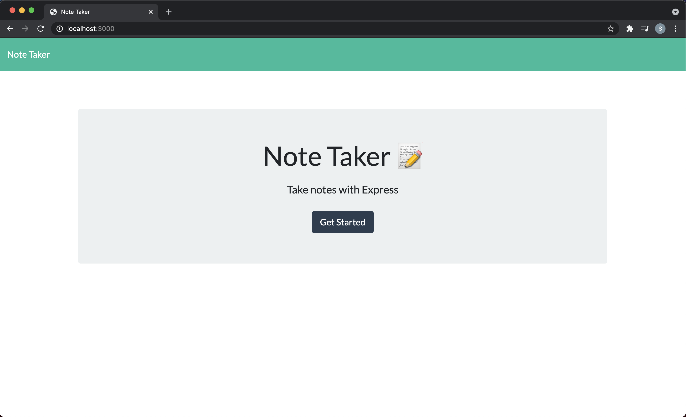
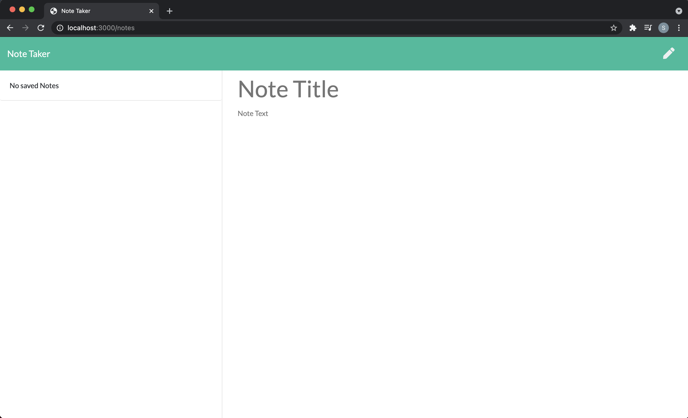
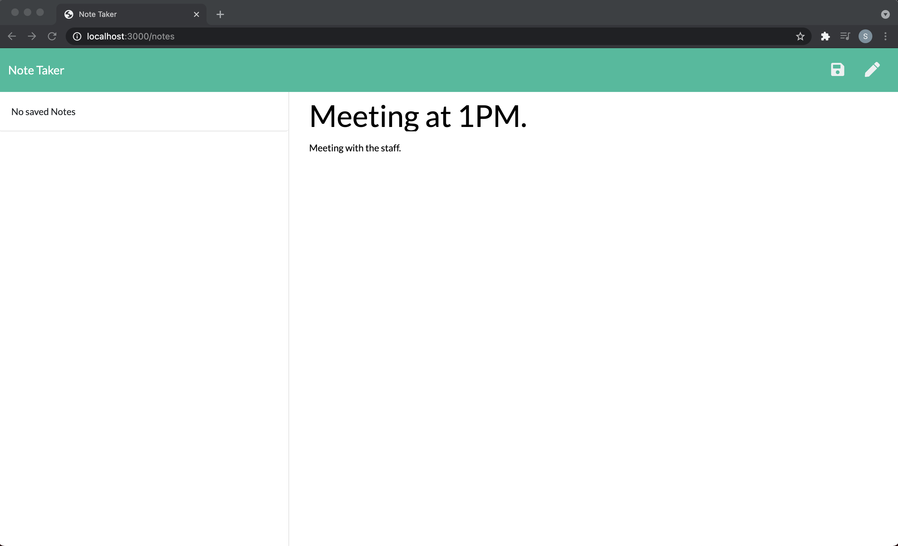
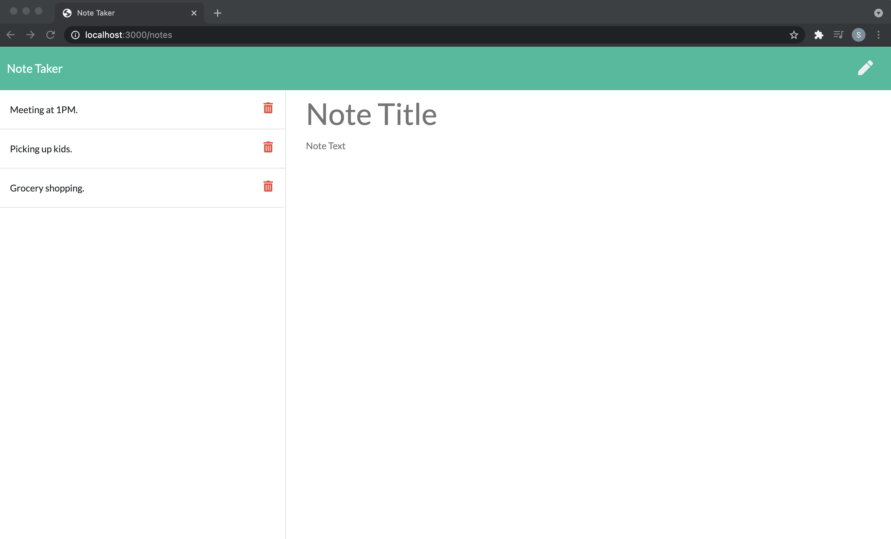
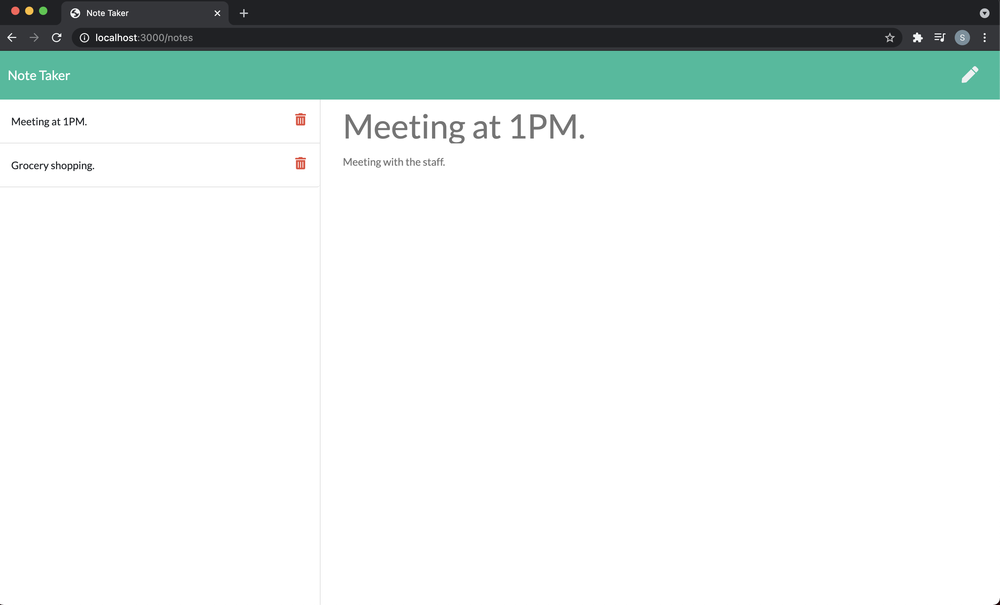
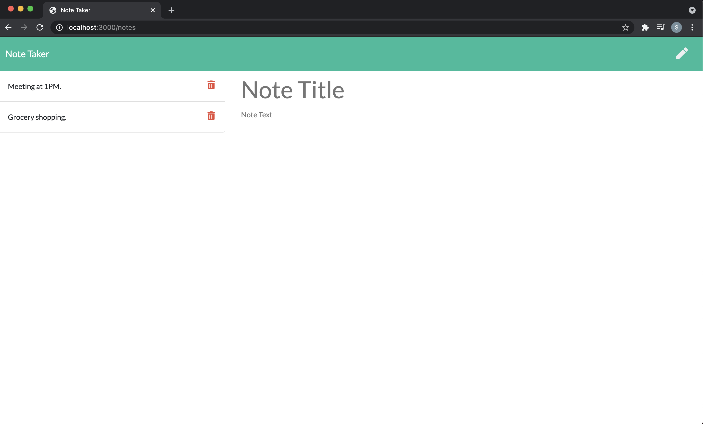

# Note-Taker

## Description

  This is a Node.js and Express.js based application that can be used to write, save and delete notes. This project utilises path, file system module and uuid npm package modules.
  
## Table of Contents

  1. [Installation](#installation)

  2. [Usage](#usage)

  3. [Contributing](#contributing)

  4. [Tests](#tests)

  5. [Links](#links)

  6. [Questions](#questions)

  7. [License](#license)

## Installation

  - Clone the application repository from: https://github.com/SamGTR/Note-Taker.git
  - Install required dependencies using `npm i` command.

## Usage

  - After installation, type node `node server.js` in the terminal to invoke the application. 
  
  - Type `http://localhost:3000/` in the browser window to run the application on your local machine.

   

  - Click on `Get Started` to go to notes section of the application.
  
   

  - Enter the note details in `Note title` and `Note text` section. When done entering the note details, click on the save button in right top corner.
  
   

  - When save button is clicked, the note is saved and its title appears in left-hand column.
  
     

  - When a note in left-hand column is clicked, it appears in the right-hand column. Also, when delete button of a note in leftr-hand column is clicked, that note is deleted.
  
     

  - When write icon located in right top corner is clicked, an empty note title and note text field appears in right-hand column to enter details of the new note. 
  
    

## Contributing

  Contributions are accepted for improving the application.

## Tests

  N/A

## Links

  Following is the link to the Github repository for Team Profile Generator application:  
  https://github.com/SamGTR/Note-Taker

  Following is the link to walkthrough video demonstrating the functionality of the application:
  https://drive.google.com/file/d/140GgQzKYCy2F21X4iOWFWCTSBvqFquIm/view?usp=sharing

## Questions

  Follow me on Github [@SamGTR](https://github.com/SamGTR)

  For any questions, reach out to sgpmecha@gmail.com

## License

  MIT
